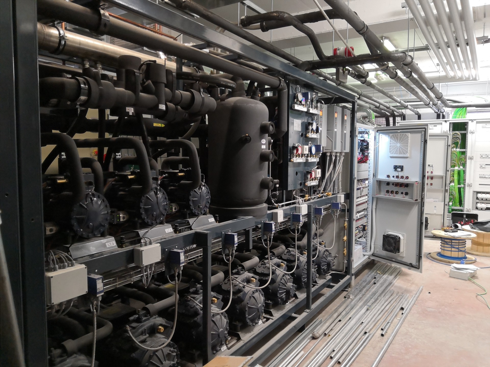

Industrial and Commercial refrigeration is a $100b+ industry. Customers are generally large, deep-pocketed companies with regular budget cycles that, given the right incentives, should have no problem adopting new technologies. However, while waves of innovation like [Industry 4.0](https://www.ibm.com/think/topics/industry-4-0) and programs such as [Horizon 2020](https://research-and-innovation.ec.europa.eu/funding/funding-opportunities/funding-programmes-and-open-calls/horizon-2020_en) had profound effects on other sectors, the refrigeration sector remained mostly untouched.

### Remote monitoring

The most classic case of this disconnec is remote monitoring. In fact, when trends like the [Internet of Things](https://en.wikipedia.org/wiki/Internet_of_things) gained popularity by promising a future where every device would be connected to the cloud, the main doubts were about the associated costs. In fact, no matter how cheap data bundles and hardware get, not all devices need to be connected to the internet. on the other hand, industrial and commercial refrigeration, being a comparatively "wealthy" sector, should not have much trouble covering the cost of bringing online massive pieces of equipment that. This should be especially true in a sector where downtime usually corresponds to non-negligible losses. Yet, it's 2022, and those markets that are so quickly adopting automatic checkouts have done little to collect data about the efficiency of their machinery. Data produced by commercial and industrial machinery is still tragically hard to retrieve. Is it really just about costs then?

### The one-time-fee curse

The core tension is really about payment structures. Medium and large businesses have a strong incentive to be as independent as possible and own as much as possible of the vertical. This clashes with the recurring payment structure that is typical of the monitoring world.

### Hardware platforms and lock-in

Another problem is about the fact that component manufacturers (compressors, inverters, PLC systems) have a strong incentive to try

### Will open monitoring ever become mainstream in this sector?