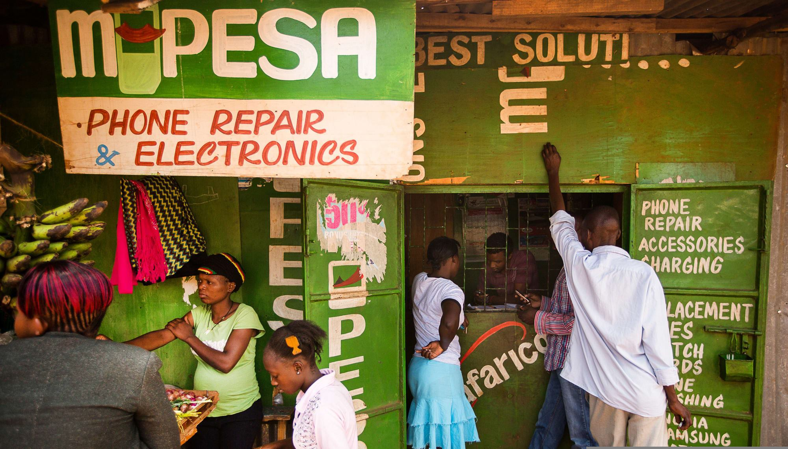

I am currently in Venezuela, visiting a dear friend. While I fell in love with this country, I had the chance to also witness the systemic inefficiencies of this place. Some are tragic, like the lack of electricity, basic healthcare services and safety, while others are much more mundane (even if still annoying), like the limited choice of products at the supermarket or the lack in digital payment solutions. So I started wondering: what could a Google Pay for Venezuela look like?

### Landscape

The incumbents that I am aware in the Venezuelan fintech sector are:

* [Pago Movil](https://www.bancodevenezuela.com/index.html@p=3457.html), for which users need access to a local bank account. Besides that, the UX is often clunky, and it’s tied to the bolívar (VES), which suffers from hyperinflation. It is also worth mentioning that in Venezuela, people often use USD for stability but Pago Movil for liquidity. Yapago would aim for a middle ground, since its ledger would track USD rather than VES.

* [Zinli](https://www.zinli.com/), for which users need a foreign bank account. While popular, Zinli is effectively a dollarized wallet backed by Banco Mercantil Panama. It leverages US-based protocols like ACH (Automated Clearing House) network and Visa’s rails through [Zelle](https://www.zelle.com/), which means that it's essentially a solution for the "connected" elite or those with family abroad.

* [Binance](https://www.binance.com), which is a generic solution focused on crypto transactions.

It seems that there might be room for a simple, local platform to exchange funds.

### What a solution could look like

Some of my experience in building transaction systems for solar mini-grids in Sub Saharan Africa could be useful. In fact, it sounds like a double entry ledger could help tackle the problem. An MVP would consist exclusively of a fund transfer feature:

1) The sender scans the QR code of the recipient or insert their handle into the mobile app.

2) Both sender and receiver are notified of the transaction.

### The on-ramp problem

Great, so we figured out the basics of how to get users to send funds to each other. However, such system is only useful if it allows users to freely move money in and out of the system. In other words: how would users convert their funds into fiat and viceversa? Here is where things get tricky. In fact, while implementing the transaction engine is fairly straight forward, creating a bridge between this system and the local banking system is a compliance problem.

* We could build integrations with the Stripes of the world to issue payouts to our users. However, as a part of the sign up process, payment processors ask their business users to provide documentation that, at the moment, is pretty much impossible to obtain from the Venezuelan [Ministry of Economy and Finances](https://www.mppef.gob.ve/).

* We could build a network of wakalas similar to the one Safaricom developed in Eastern Africa with [Mpesa](https://www.m-pesa.africa/). However, building such a network would require massive amounts of funding and years of work. The political and economic instability of the country would probably make it extra hard to raise funding.

### Conclusion

At the moment it looks like, with my resources, connections and commitments, the best I can do is a wrapper around current solutions (eg Binance). This would remove the core value of my solution while making it overly dependent on incumbent services, which could easily eliminate my solution by implementing a new lightweight interface.