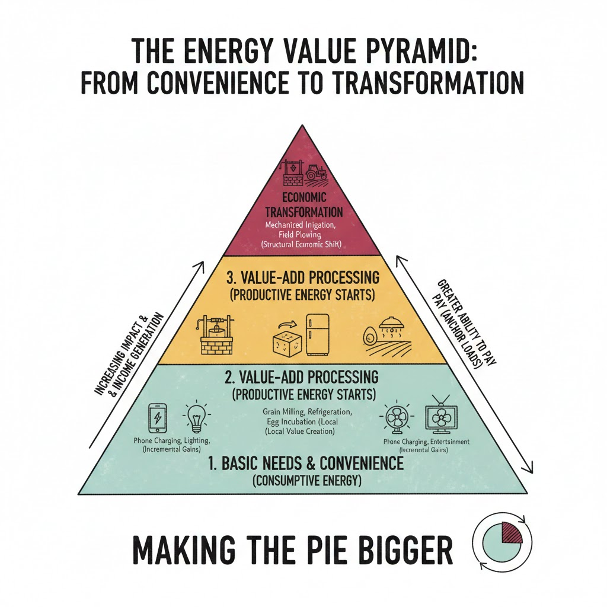

In the context of energy access, "PUE" stands for "Productive Use of Energy". It describes the use of energy to generate income, create value, or improve productivity. It is the holy grail of energy access and dream of every entrepreneur in the sector. This is because PUE tackles two different problems at once:

* **Financial viability**. PUE creates a virtuous cycle for the utility or energy provider. By enabling income-generating activities, the provider shifts the customer base from low-consumption households to "anchor loads." These users consume more energy and, crucially, have a higher ability to pay because the energy itself is financing their bill. This reduces the risk of default and improves the payback period on infrastructure.

* **Poverty reduction**. Unlike basic electrification — which provides comfort (lighting) but rarely changes a family's economic bracket — PUE addresses the productivity gap. By mechanizing labor-intensive tasks (like milling grain or pumping water), energy saves time and multiplies output. This transitions a community from subsistence to a surplus economy, creating local jobs that outlast the initial energy project.

However, PUE is surprisingly hard to achieve. In fact, if the "600 million people without access to energy" pitch helped companies like [Sunking](https://sunking.com/), [Zola](https://zolaintelligence.com/) and similar solar startups get investor support to develop solutions for the residential market (lamps, TV sets, fans, phone chargers and more) most productive use cases remain mostly untouched. I keep wondering: if productive use cases turn energy into a platform on which customers generate income, it would not be unreasonable to think that they would make productive users better customers. In other words, wouldn't PUE customers likely be the best customers? Maybe, PUE is hard not because of a lack of incentives.

### Making the pie bigger

If we visualize energy use as a pyramid, we can see a clear divide between convenience and transformation. At the broad base are 'light' applications: phone charging, LED bulbs, and home entertainment. These improve quality of life, but their economic impact is often capped. A shopkeeper might earn a few extra dollars by offering phone charging, but the 'size of the pie' remains largely the same. As we move up the pyramid into refrigeration and grain milling, we enter the realm of value-added processing. At the very peak, we find 'heavy' applications: well-digging, mechanized irrigation, and field plowing. This is where the magic happens. While lighting merely extends the hours of an existing economy, industrial-scale energy expands that economy. A community that moves from hand-tilling to mechanized irrigation doesn't just work longer; they produce more, waste less, and unlock the ability to sell processed goods rather than raw commodities. To truly 'make the pie bigger,' we must shift our focus from energy for consumption to energy for production.

### Is this really about energy?

Of course, a tractor cannot be powered through solar energy, and a well cannot be dug with a solar-powered excavator (yet). This makes me wonder then: is this really about energy, or rather about power? To move the needle on poverty, we don't just need kilowatt-hours spread over a day; we need the high-torque, high-wattage capability to move heavy machinery.

If we assume that "increasing the pie" is more about power than about energy, then the question becomes: is solar always the best way to achieve it? Distributed solar is excellent for efficiency and low-load electronics. But for the "top of the pyramid" tasks, the capital expenditure (CAPEX) for batteries and inverters capable of handling high surge currents is often prohibitive for the very communities that need them most.

### Domain thinking

I am a big fan of domain thinking. When solving a problem in a given domain is hard, changing domains often improves one's odds to solve it. One of my favourite examples of this is Fourier Transforms in mathematics, where complex integrals can be turned into simple multiplications, which can then be solved much more easily. In our case, if we view PUE strictly as an energy problem, we get stuck on the physical constraints of hardware, which make it prohibitively expensive to solve any kind of problem in a context which is extremely price sensitive.

### The financial domain

When productivity is seen with the eyes of an investor rather than an engineer, it becomes a financing problem. What if, instead of changing the technical specs of the tools available to the farmers, we just focus on making them more accessible? This can be done in several ways. Here are a couple

* **Rent-to-own**. Much like the Solar Home Systems (SHS) revolution, applying lease-to-own models to high-torque machinery lowers the barrier to entry. The asset itself acts as the collateral, and the increased yield from the "power" pays for the "energy."

* **Cost-spreading**. Companies like [Hello Tractor](https://hellotractor.com/) offer on-demand plowing services to farmers. This shifts the burden from CAPEX (buying the tractor) to OPEX (paying for the service), allowing the "pie-growing" activity to happen without the user needing to solve the energy/power infrastructure problem themselves.

### Conclusion

As engineers, we often have a tendency to see the problems around us from a technical point of you. If we stay stuck in the "energy domain," we keep trying to build cheaper batteries or smarter load-shedding algorithms. These are noble pursuits, but they are incremental. However, when we shift domains — into finance, logistics, or even community-based ownership models — we find that we can bypass technical bottlenecks entirely. We stop trying to make a solar panel act like a diesel generator and instead build a financial system that makes the "force" of a diesel generator affordable, or a sharing economy that makes it efficient.