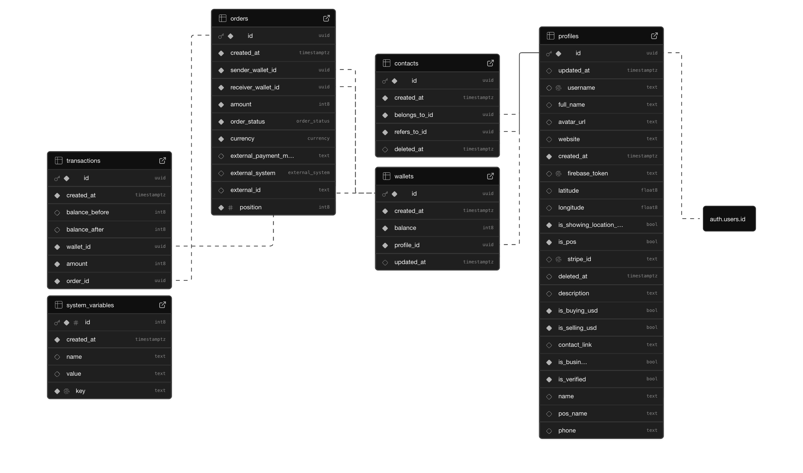
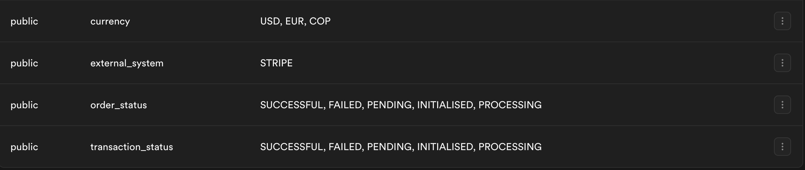

# Double-entry accounting

Yapago relies on a double-entry ledger that looks like the image below. The entire schema can be found [here](https://github.com/yebosoftware/yapago_api).

<!-- insert image here -->



### Use of cents

Floating-point numbers (like 0.1 + 0.2) are notorious for causing precision errors due to how they are represented in binary precision. By using integers (cents), wee avoid the "lost penny" problem where $19.999998$ might be rounded incorrectly. Every currency calculation remains deterministic across different programming languages and database engines. This is the industry standard for payment processors like Stripe and Adyen.

### Double-Entry Transactions

The core principle here is that money is never "created" or "destroyed" in the system; it only moves from one place to another. More specifically, a few points are worth mentioning:

* The **"net zero"** rule: For every "debit" (+), there is a corresponding "credit" (-). If you sum the entire transactions table, the result should ideally be zero (or match your system's initial liquidity).

* **Audit trail**: This creates an immutable history. If a user’s balance looks wrong, you can replay every + and - transaction to see exactly where the discrepancy occurred.

* Wallet **isolation**. Because each transaction is a row, calculating a wallet balance is a simple SUM() operation on that specific wallet_id.

* For every order, **two** transactions are created, one in positive and the other in negative. In this way, reconciliation is always possible. Also the transactions table makes is easy to fetch data about a a single wallet.

### Low cardinality enums to represent order status

Using a database ENUM for order status is a performance and integrity choice.

* **Data integrity**. It prevents "garbage" data (e.g., someone accidentally entering a status like "PENDINGG") from entering the database.

* **Storage efficiency**. Enums are stored internally as integers, which is much faster for the database to index and search than long strings of text.

* **Predictability**. Since the workflow (Pending -> Processing -> Success/Fail) is stable, the overhead of managing a separate "Statuses" table is unnecessary.



### Atomic order locking: the queue pattern

The queue pattern. It ensures that exactly one worker handles one order at a time.

* Race condition prevention. Without this, two different background workers might pick up the same pending order at the same microsecond and process it twice.

* The query below ensures that no new order starts processing if there is already an order currently in the PROCESSING state, maintaining a strict sequential flow.

```
update orders
set order_status = 'PROCESSING'
where orders.id in (
  select a.id
  from orders as a
  where a.order_status = 'PENDING'
  order by a.position asc 
  limit 1
) and not exists (
  select *
  from orders as b
  where b.order_status = 'PROCESSING'
) returning orders.id
```

### Schema denormalization

In a "pure" database, we would always calculate balance on the fly. However, as the transactions table grows to millions of rows, SUM() becomes slow.

* Read vs. Write Trade-off: You are choosing to make "Writes" slightly more complex (running a function after an order) to make "Reads" (checking a balance) instant.

* Simplified Queries: Instead of joining three tables every time a user wants to see their dashboard, you can simply query wallets.balance.

* Sync Strategy: The function you mentioned acts as a "Trigger-like" mechanism to ensure the denormalized balance stays in sync with the source of truth (the transactions).

```
select sum(transactions.amount)
from transactions
left join orders on orders.id = transactions.order_id
where wallet_id = calculate_balance_by_wallet_id.wallet_id
and orders.order_status = 'SUCCESSFUL'
```